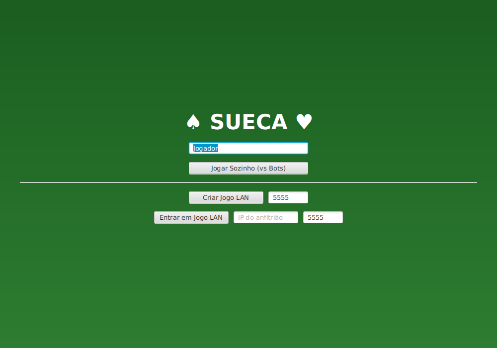
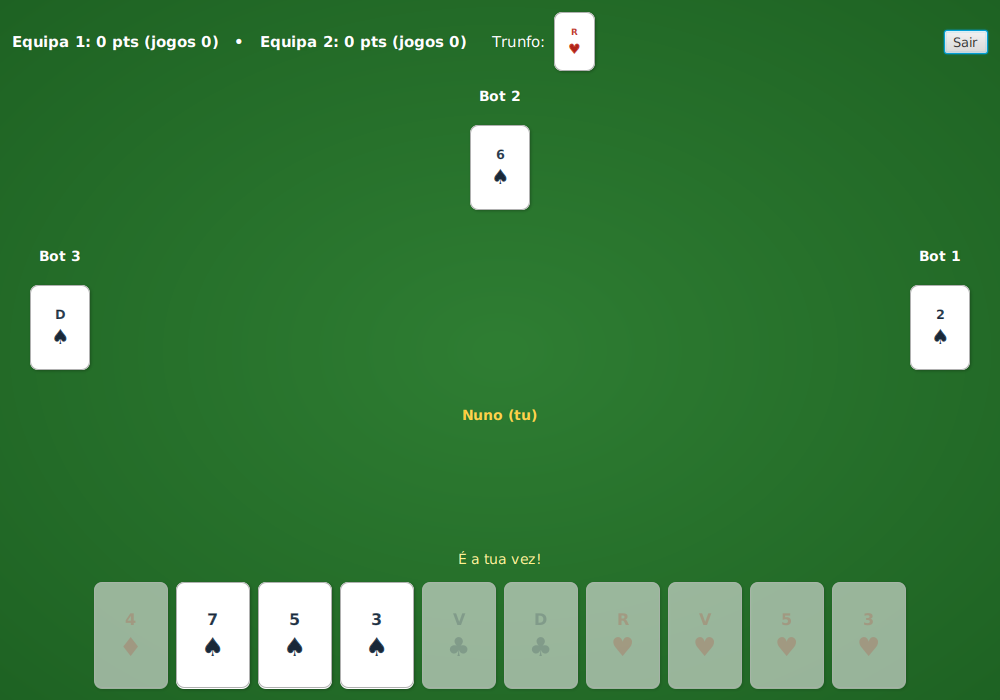
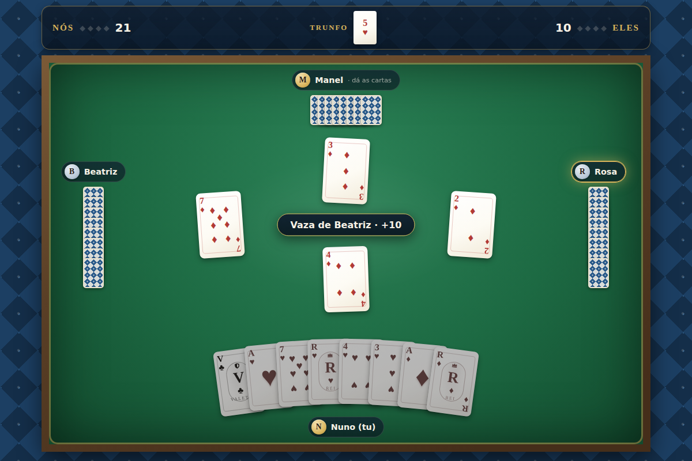
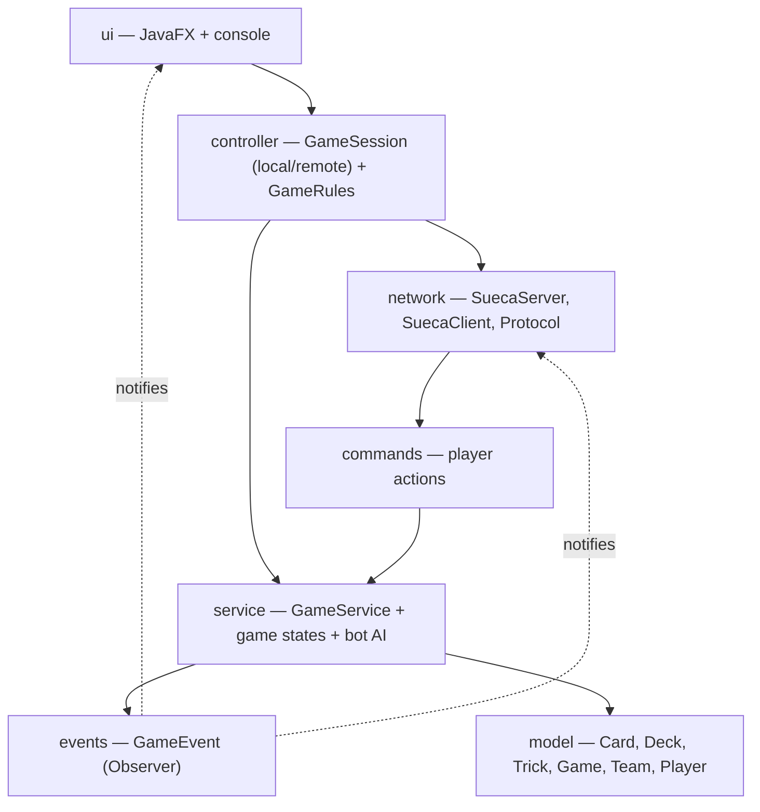

# Sueca

[](https://github.com/Nokz22/SuecaGame/actions/workflows/build.yml)

Sueca is the card game you'll find in just about every Portuguese café: four
players, two teams, a 40-card deck, and endless arguments about who wasted a
trump. This is a full implementation of the game in Java, with a JavaFX
interface, bots to play against, and LAN multiplayer for up to four people.
There's also a browser version in [`web/`](web/) that runs entirely
client-side, so you can play without installing anything.

**[▶ Play in the browser](https://nokz22.github.io/SuecaGame/)** ·
**[⬇ Download for desktop](https://github.com/Nokz22/SuecaGame/releases)**

| Menu | Game table |
|---|---|
|  |  |

## Never played Sueca?

The short version: each player gets 10 cards and one suit is trump. You must
follow the lead suit whenever you can. The trick goes to the highest trump
played, or to the highest card of the lead suit if nobody trumped. Aces are
worth 11 points, sevens 10, kings 4, jacks 3, queens 2 — 120 points on the
table every round. Your team needs 61 of them to score a game point; 91 or
more is worth two, and sweeping all 120 (a *capote*) is worth four. First
team to reach 4 game points wins the match.

## Features

- **Single player** against three bots. They're not random: they follow suit,
  cut with trump when they're out, win tricks as cheaply as possible, and pile
  points onto a trick their partner is already winning.
- **LAN multiplayer** for up to 4 players. One player hosts (the server runs
  embedded in the app), the rest join with the host's IP. Empty seats are
  filled with bots, and if someone disconnects mid-game a bot takes over so
  the match can finish.
- **Online multiplayer in the browser** — rooms with a shareable 4-letter
  code, connected peer-to-peer over WebRTC. No accounts, no game server.
- **Full rules**: mandatory follow-suit, trump, 10 tricks per round,
  the 1/2/4 scoring ladder and matches to 4 game points.
- A **console version** as well, with a `--demo` mode where four bots play a
  complete match on their own — handy for watching the engine work.

## Getting it running

### Just play

Grab the JAR for your system from the
[releases page](https://github.com/Nokz22/SuecaGame/releases) —
`SuecaGame-win.jar`, `SuecaGame-mac.jar` (Intel), `SuecaGame-mac-aarch64.jar`
(Apple Silicon) or `SuecaGame-linux.jar` — and double-click it, or run:

```bash
java -jar SuecaGame-win.jar
```

JavaFX is bundled inside the JAR. The only requirement is Java 21 or newer.

### From source

You'll need Java 21+ and Maven:

```bash
mvn javafx:run                              # desktop app
mvn compile exec:java                       # console version
mvn compile exec:java -Dexec.args="--demo"  # four bots play a full match
mvn test                                    # test suite
```

### Playing over LAN

The host picks *Criar Jogo LAN* (default port 5555) and shares their local
IP; everyone else picks *Entrar em Jogo LAN* and types it in. When the host
presses start, any seat still empty becomes a bot. If the connection is
refused, it's almost always the host's firewall — allow Java through on that
port.

## The browser version

The [`web/`](web/) folder has a JavaScript remake of the game — same rules,
same bot heuristics — with no build step: plain ES modules, CSS-drawn cards
and an azulejo-tiled table. It deploys to GitHub Pages automatically on
every push to `main`.



You can play it two ways:

- **Solo** against the three bots, all in your browser.
- **Online with friends**: one player creates a room and gets a 4-letter
  code; up to three others join with it (or with the invite link the code
  copies). Seats left empty become bots, and anyone who drops mid-game is
  replaced by a bot so the match finishes.

Online play works without a game server. The browsers connect directly to
each other over WebRTC data channels; the host's browser runs the
authoritative engine and deals each player only their own hand — exactly the
same trust model as the desktop LAN server. The only third party involved is
PeerJS's free public broker, used once per connection for the WebRTC
handshake; after that, no game data touches any server. The trade-offs of
being serverless: the room lives and dies with the host's tab, and a small
minority of very restrictive networks won't manage a direct connection.

Handy URLs: `?jogar=Name` skips the menu straight to a solo table,
`?sala=CODE` pre-fills a room invite, and `?demo` puts bots in all four
seats so you can just watch.

The web engine has two test harnesses, both plain Node with no test
framework: `web/test/selfplay.mjs` plays 300 complete matches and asserts
the same invariants as the Java suite (ten tricks and exactly 120 points,
every round), and `web/test/netplay.mjs` runs a full online match through
an in-memory transport with the same interface as the WebRTC adapter —
covering seat assignment, hand privacy, remote play validation and the
drop-to-bot path.

## How it's built

The core idea is that the game engine is the only thing that knows the rules,
and everything else just reacts to it. The domain model has no dependencies,
the UI never decides anything (it only pre-validates plays so illegal cards
appear disabled), and in multiplayer the server is authoritative: each client
receives its own hand and nothing else, and never picks its own seat.



A few decisions worth explaining:

- **One session abstraction.** The UI talks to a `GameSession` and genuinely
  doesn't know whether the game is in-process against bots or across the
  network — single player and multiplayer share the same game screen.
- **Events as a sealed interface.** Every game event is a record implementing
  `GameEvent`, so the compiler forces exhaustive handling everywhere events
  are consumed (UI, network protocol, server). Adding an event type breaks
  the build until every consumer deals with it, which is exactly what I want.
- **Game phases as classes** (waiting, dealing, playing, scoring, game over).
  Each phase defines what's allowed in it, which keeps phase checks from
  leaking all over the service.
- **A line-based text protocol.** Cards serialize as `COPAS:ÀS`, events as
  simple pipe-separated lines. You can debug a game with `nc`. No
  serialization libraries, nothing to version.
- **A seeded `Random` in the engine.** Tests can play entire rounds
  deterministically — the suite includes full bot-vs-bot rounds that must
  come out to exactly 10 tricks and 120 points.

The deck factory, the command parsing for network messages and the pluggable
bot strategy are the usual Factory / Command / Strategy suspects; the event
system is a plain Observer.

## Tests

`mvn test` runs 30 unit and integration tests:

- deck invariants (40 unique cards, 120 points total), tricks and lead suit;
- rules: follow-suit enforcement, trick winners with and without trump, and
  every scoring boundary (60/61/90/91/119/120);
- engine: complete bot-played rounds, match end at 4 game points, playing out
  of turn and revoking both rejected;
- network: protocol round-trips, plus a real socket test that boots a server,
  connects a client and checks it gets seated and dealt exactly its own hand.

## Ideas for later

- Let a disconnected player rejoin and take their seat back from the bot
- Card animations and sound on the desktop table
- Smarter bots (they don't count cards yet — humans still win)
- Match history and stats
