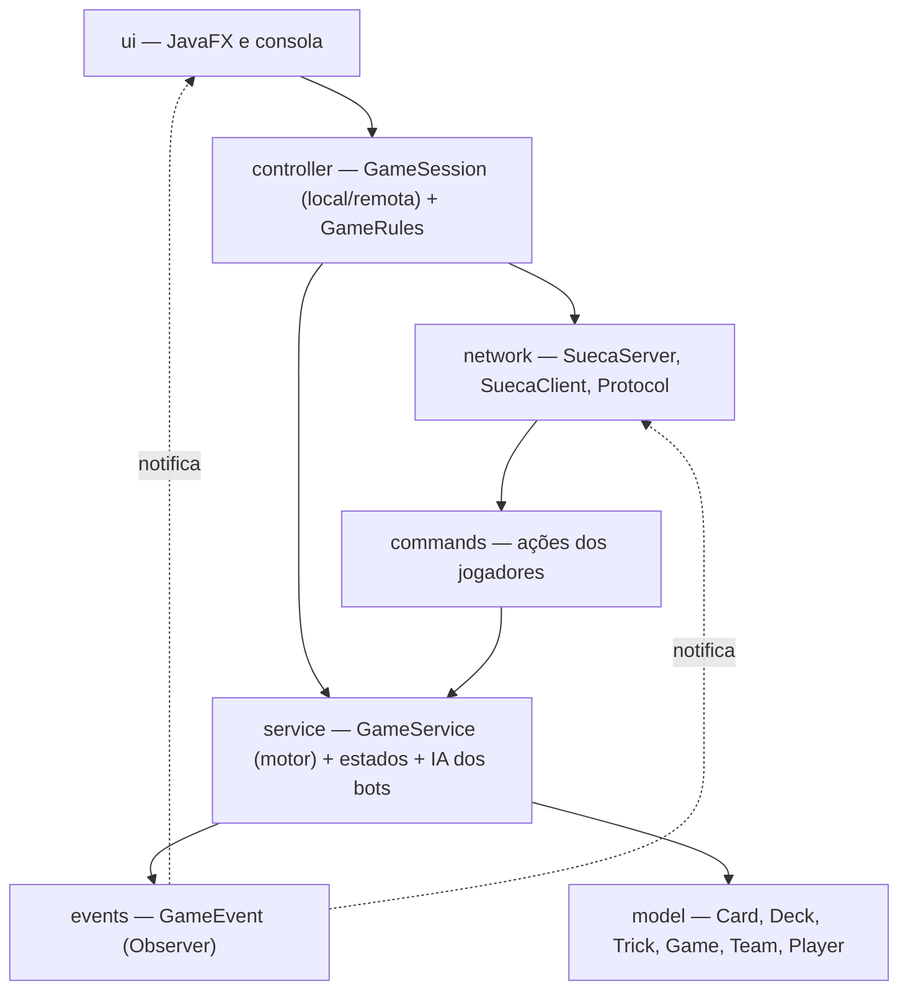

# ♠ SuecaGame ♥

Jogo de **Sueca** — o clássico jogo de cartas português — em Java, com interface gráfica JavaFX,
modo **single player** contra bots e **multiplayer em rede local (LAN)** até 4 jogadores.

| Menu | Mesa de jogo |
|---|---|
|  |  |

## Funcionalidades

- **Single player** — jogas contra 3 bots com heurísticas de Sueca (assistem ao naipe, cortam,
  carregam a vaza quando o parceiro vai a ganhar).
- **Multiplayer LAN** — um jogador cria o jogo (servidor embebido) e os outros entram com o IP
  do anfitrião. Lugares vazios são preenchidos por bots; se um jogador cair a meio, um bot
  assume o lugar e o jogo continua.
- **Regras completas de Sueca** — obrigação de assistir ao naipe, trunfo, 10 vazas por ronda,
  120 pontos em jogo, pontuação por ronda (61–90 → 1 jogo, 91–119 → 2 jogos, 120 → 4 jogos
  de capote) e partida à melhor de 4 jogos.
- **Duas interfaces** — JavaFX (gráfica) e consola (com modo `--demo` totalmente automático).

## Como correr

Requisitos: **Java 21+** e **Maven**.

```bash
# Interface gráfica (JavaFX)
mvn javafx:run

# Versão de consola (single player)
mvn compile exec:java

# Demo automática na consola (4 bots jogam uma partida completa)
mvn compile exec:java -Dexec.args="--demo"

# Testes
mvn test
```

**Multiplayer LAN:** o anfitrião escolhe *Criar Jogo LAN* (porta 5555 por omissão) e partilha
o seu IP local; os restantes escolhem *Entrar em Jogo LAN* com esse IP. Quando o anfitrião
carrega em *Começar Jogo*, os lugares por ocupar passam a bots.

## Arquitetura

MVC reforçado com camadas de serviço, eventos e rede — o domínio (`model`) não depende
de nada; a UI nunca decide regras, apenas reage a eventos do motor.



### Padrões de design

| Padrão | Onde | Porquê |
|---|---|---|
| **Observer** | `events.GameEvent` / `GameEventListener` | O motor emite eventos; UI e servidor reagem sem acoplamento. O servidor reencaminha os eventos aos clientes pela rede. |
| **State** | `service.*State` (espera → distribuição → jogada → contagem → fim) | Cada fase define o que é permitido; elimina ifs de fase espalhados pelo código. |
| **Factory** | `model.DeckFactory`, `commands.CommandFactory` | Criação do baralho de 40 cartas e construção de comandos a partir das mensagens de rede. |
| **Command** | `commands.PlayCardCommand`, `StartGameCommand` | Ações dos jogadores serializáveis pela rede, executadas pelo servidor. |
| **Strategy** | `service.ai.BotStrategy` / `SmartBotStrategy` | A IA dos bots é substituível sem tocar no motor. |

### Decisões técnicas

- **Servidor autoritativo** — no multiplayer, só o servidor tem o estado do jogo. Cada cliente
  recebe apenas a própria mão e nunca escolhe o próprio lugar; validação de jogadas é sempre
  feita no motor. A UI apenas pré-valida para desativar cartas ilegais.
- **Uma única abstração de sessão** — a UI fala com `GameSession` e não sabe se o jogo é local
  (contra bots) ou remoto: o single player e o multiplayer partilham o mesmo ecrã de jogo.
- **Protocolo de texto por linhas** — simples de depurar com `telnet`/`nc`, sem dependências
  de serialização. Eventos e cartas têm codificação estável (`COPAS:ÀS`).
- **Eventos como `sealed interface` + `records`** — o compilador garante switch exaustivo
  em todos os pontos que tratam eventos (UI, protocolo, servidor).
- **Concorrência contida** — o motor sincroniza as ações; no JavaFX todos os eventos passam
  por `Platform.runLater`, preservando a ordem e mantendo a UI fora das threads de rede.
- **Motor determinístico nos testes** — o `GameService` aceita um `Random` com seed, o que
  permite testar rondas completas (10 vazas, 120 pontos) de forma reprodutível.

## Testes

30 testes unitários e de integração (`mvn test`):

- **model** — baralho de 40 cartas únicas com 120 pontos; vazas e naipe de saída.
- **controller** — regras: assistir ao naipe, vencedor com/sem trunfo, fronteiras da pontuação
  (60/61/90/91/119/120).
- **service** — rondas completas jogadas por bots (10 vazas, 120 pontos), fim de partida aos
  4 jogos, jogadas fora de vez e renúncias rejeitadas.
- **network** — round-trip do protocolo e teste de integração com servidor e cliente reais
  ligados por socket, do `JOIN` até às cartas na mão.

## Estrutura

```
src/main/java/com/suecagame/
├── model/        # Domínio puro: Card, Deck, DeckFactory, Trick, Game, Team, Player
├── events/       # GameEvent (sealed) + GameEventListener (Observer)
├── service/      # GameService (motor), estados do jogo, ai/ (bots)
├── commands/     # Command + CommandFactory (ações dos jogadores)
├── network/      # SuecaServer, SuecaClient, ClientHandler, Protocol
├── controller/   # GameRules, GameSession (local e remota)
└── ui/           # SuecaApplication, MenuView, LobbyView, GameView (JavaFX) e console/
src/test/java/    # Testes por camada (model, controller, service, network)
```

## Roadmap

- Reconexão de jogadores no multiplayer (retomar o lugar ao bot).
- Animações e sons na mesa de jogo.
- IA mais forte (memória das cartas jogadas).
- Estatísticas e histórico de partidas.
